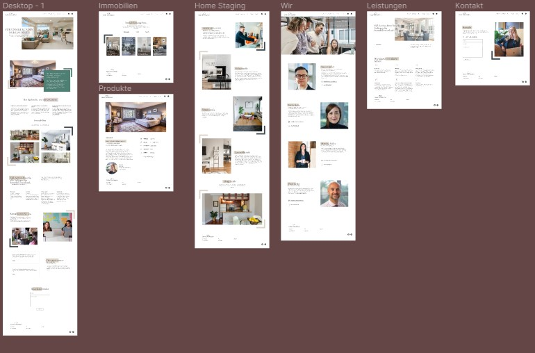
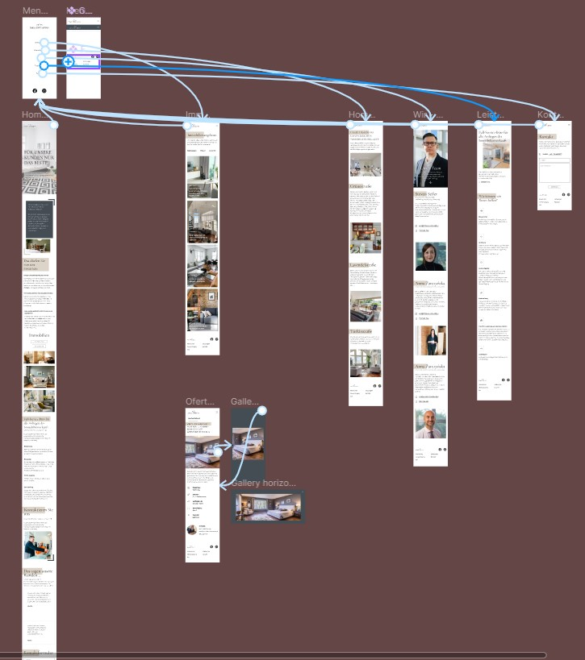
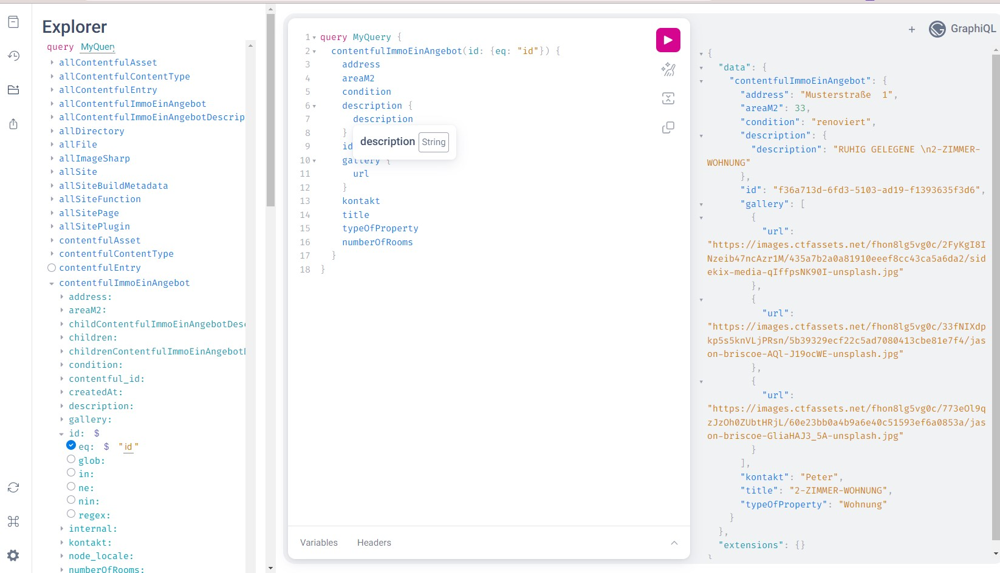
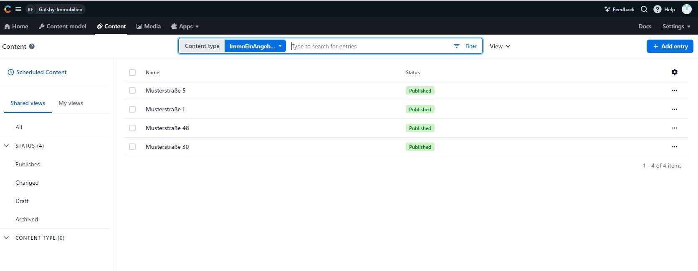
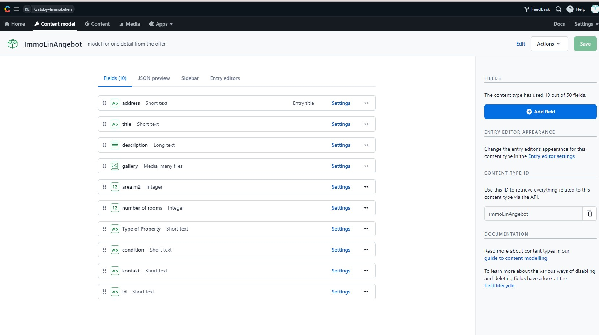
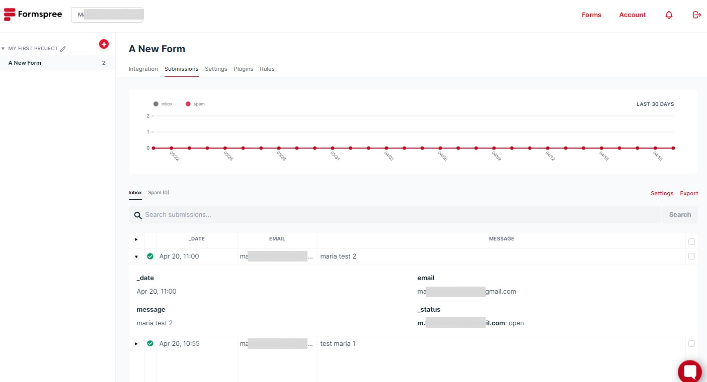

<h2>Website Template for "Real Estate Agency" (in german)</h2>
<h1>Gatsby + GraphQL + Contentfull + Formspree + Netlify</h1>
<h2>https://gatsby-contentful-netlify-immobilien.netlify.app</h2>		
<h4>Design in Figma:</h4>
<p>
	
	
</p>
<h4>GraphQL:</h4>
<p>
		
</p>
<h4>Contentful:</h4>
<p>
		
		
</p>
<h4>Formspree:</h4>
<p>
		
</p>
	
<br>
<br>
	
	
	
<p align="center">
  <a href="https://www.gatsbyjs.com/?utm_source=starter&utm_medium=readme&utm_campaign=minimal-starter">
    
  </a>
</p>
<h1 align="center">
  Gatsby Minimal Starter

</h1>

## 🚀 Quick start

1.  **Create a Gatsby site.**

    Use the Gatsby CLI to create a new site, specifying the minimal starter.

    ```shell
    # create a new Gatsby site using the minimal starter
    npm init gatsby
    ```

2.  **Start developing.**

    Navigate into your new site’s directory and start it up.

    ```shell
    cd my-gatsby-site/
    npm run develop
    ```

3.  **Open the code and start customizing!**

    Your site is now running at http://localhost:8000!

    Edit `src/pages/index.js` to see your site update in real-time!

4.  **Learn more**

    - [Documentation](https://www.gatsbyjs.com/docs/?utm_source=starter&utm_medium=readme&utm_campaign=minimal-starter)
    - [Tutorials](https://www.gatsbyjs.com/docs/tutorial/?utm_source=starter&utm_medium=readme&utm_campaign=minimal-starter)
    - [Guides](https://www.gatsbyjs.com/docs/how-to/?utm_source=starter&utm_medium=readme&utm_campaign=minimal-starter)
    - [API Reference](https://www.gatsbyjs.com/docs/api-reference/?utm_source=starter&utm_medium=readme&utm_campaign=minimal-starter)
    - [Plugin Library](https://www.gatsbyjs.com/plugins?utm_source=starter&utm_medium=readme&utm_campaign=minimal-starter)
    - [Cheat Sheet](https://www.gatsbyjs.com/docs/cheat-sheet/?utm_source=starter&utm_medium=readme&utm_campaign=minimal-starter)

## 🚀 Quick start (Netlify)

Deploy this starter with one click on [Netlify](https://app.netlify.com/signup):

[](https://app.netlify.com/start/deploy?repository=https://github.com/gatsbyjs/gatsby-starter-minimal)
